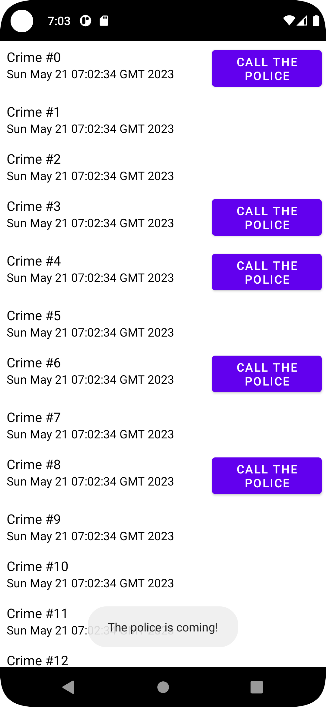

<p align = "center">МИНИСТЕРСТВО НАУКИ И ВЫСШЕГО ОБРАЗОВАНИЯ<br>
РОССИЙСКОЙ ФЕДЕРАЦИИ<br>
ФЕДЕРАЛЬНОЕ ГОСУДАРСТВЕННОЕ БЮДЖЕТНОЕ<br>
ОБРАЗОВАТЕЛЬНОЕ УЧРЕЖДЕНИЕ ВЫСШЕГО ОБРАЗОВАНИЯ<br>
«САХАЛИНСКИЙ ГОСУДАРСТВЕННЫЙ УНИВЕРСИТЕТ»</p>
<br><br><br><br><br><br>
<p align = "center">Институт естественных наук и техносферной безопасности<br>Кафедра информатики<br>Григораш Алексей Владимирович</p>
<br><br><br>
<p align = "center">Лабораторная работа № 8<br><strong>«Вывод списков и RecyclerView»</strong><br>01.03.02 Прикладная математика и информатика</p>
<br><br><br><br><br><br><br><br><br><br><br><br>
<p align = "right">Научный руководитель<br>
Соболев Евгений Игоревич</p>
<br><br><br>
<p align = "center">г. Южно-Сахалинск<br>2023 г.</p>
<br><br><br><br><br><br><br><br>

## Введение:
**Android Studio** — интегрированная среда разработки производства Google, с помощью которой разработчикам становятся доступны инструменты для создания приложений на платформе Android OS


## Задачи:
**Упражнение. Типы View в RecyclerView**

Для этого сложного упражнения вам нужно будет создать два типа строк в вашем RecyclerView: для обычных и для более серьезных преступлений. Чтобы это реализовать, вы будете работать с функцией в RecyclerView.Adapter. Присвойте новое свойство requiresPolice объекту Crime и используйте его, чтобы определить, какой тип View загружен в CrimeAdapter, путем реализации функции getItemViewType(Int) (developer.android.com/reference/android/support/v7/widget/RecyclerView.Adapter.html#getItemViewType). В функции onCreateViewHolder(ViewGroup, Int) вам также необходимо добавить логику, которая возвращает различные ViewHolder в зависимости от ViewType, возвращаемого функцией getItemViewType(Int). Используйте оригинальный макет для преступлений, которые не требуют вмешательства полиции, и новый макет с усовершенствованным интерфейсом, содержащий кнопку с надписью «Связаться с полицией» для серьезных преступлений.


## Решение:

<div align="center">
    
</div>

## CrimeListFragment.kt
```kt
package com.example.criminalintent
import android.os.Bundle
import android.util.Log
import android.view.LayoutInflater
import android.view.View
import android.view.ViewGroup
import android.widget.Button
import android.widget.TextView
import android.widget.Toast
import androidx.fragment.app.Fragment
import androidx.lifecycle.ViewModelProviders
import androidx.recyclerview.widget.LinearLayoutManager
import androidx.recyclerview.widget.RecyclerView

private const val TAG = "CrimeListFragment"

class CrimeListFragment : Fragment() {

    private lateinit var crimeRecyclerView: RecyclerView
    private var adapter: CrimeAdapter? = null

    private lateinit var callThePolice: Button

    private val crimeListViewModel: CrimeListViewModel by lazy {
        ViewModelProviders.of(this).get(CrimeListViewModel::class.java)
    }

    override fun onCreate(savedInstanceState: Bundle?) {
        super.onCreate(savedInstanceState)
        Log.d(TAG, "Total crimes: ${crimeListViewModel.crimes.size}")
    }

    companion object {
        fun newInstance(): CrimeListFragment {
            return CrimeListFragment()
        }
    }

    override fun onCreateView(
        inflater: LayoutInflater,
        container: ViewGroup?,
        savedInstanceState: Bundle?
    ): View? {
        val view = inflater.inflate(R.layout.fragment_crime_list, container, false)
        crimeRecyclerView =
            view.findViewById(R.id.crime_recycler_view) as RecyclerView
        crimeRecyclerView.layoutManager = LinearLayoutManager(context)

        updateUI()

        return view
    }

    private fun updateUI() {
        val crimes = crimeListViewModel.crimes
        adapter = CrimeAdapter(crimes)
        crimeRecyclerView.adapter = adapter
    }

    private inner class CrimeHolder(view: View)
        : RecyclerView.ViewHolder(view), View.OnClickListener {

        private lateinit var crime: Crime

        val titleTextView: TextView = itemView.findViewById(R.id.crime_title)
        val dateTextView: TextView = itemView.findViewById(R.id.crime_date)

        init {
            itemView.setOnClickListener(this)
        }

        fun bind(crime: Crime) {
            this.crime = crime
            titleTextView.text = this.crime.title
            dateTextView.text = this.crime.date.toString()

            // lab 8
            if(crime.isSeriousCrime){
                callThePolice = itemView.findViewById(R.id.call_the_police)
                callThePolice.setOnClickListener{
                    Toast.makeText(context, "The police is coming!", Toast.LENGTH_SHORT).show()
                }

            }
        }

        override fun onClick(v: View) {
            Toast.makeText(context, "${crime.title} pressed!", Toast.LENGTH_SHORT)
                .show()
        }

    }

    private inner class CrimeAdapter(var crimes: List<Crime>)
        : RecyclerView.Adapter<CrimeHolder>() {
        override fun onCreateViewHolder(parent: ViewGroup, viewType: Int)
                : CrimeHolder {
//            val view = layoutInflater.inflate(R.layout.list_item_crime, parent, false)

            // lab 8
            val view = if (viewType == 0) layoutInflater.inflate(R.layout.list_item_crime, parent, false)
            else layoutInflater.inflate(R.layout.list_item_crime_call_the_police, parent, false)


            return CrimeHolder(view)
        }
        override fun getItemCount() = crimes.size

        override fun onBindViewHolder(holder: CrimeHolder, position: Int) {
            val crime = crimes[position]
//            holder.apply {
//                titleTextView.text = crime.title
//                dateTextView.text = crime.date.toString()
//            }

            holder.bind(crime)
        }

        // lab 8
        override fun getItemViewType(i: Int): Int {
            val crime = crimes[i]
            return if (crime.isSeriousCrime) 1 else 0
        }
    }
    
}
```

## CrimeListViewModel.kt
```kt
package com.example.criminalintent

import androidx.lifecycle.ViewModel
import kotlin.random.Random

class CrimeListViewModel: ViewModel() {

    val crimes = mutableListOf<Crime>()
    init {
        for (i in 0 until 100) {
            val crime = Crime()
            crime.title = "Crime #$i"
            crime.isSolved = i % 2 == 0

            val rnd = Random.nextBoolean()
            crime.isSeriousCrime = rnd

            crimes += crime

        }
    }
}

```


## Вывод:
В ходе выполнения задач изучил RecyclerView